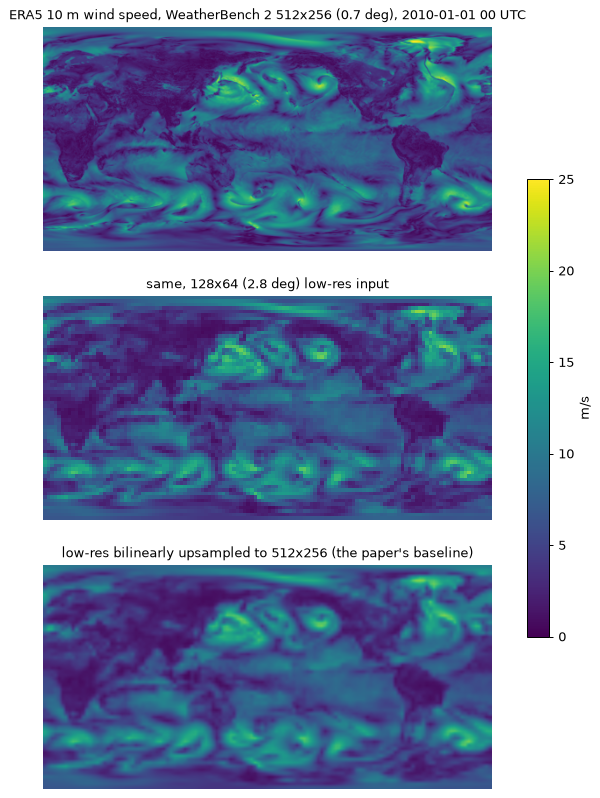

# Notes: PyTorch reimplementation of Merizzi, Asperti and Colamonaco (2024)

Paper: "Wind speed super-resolution and validation: from ERA5 to CERRA via diffusion models", Neural Computing and Applications 36:21899-21921, https://doi.org/10.1007/s00521-024-10139-9. Authors' code: https://github.com/fmerizzi/ERA5-to-CERRA-via-Diffusion-Models/ (TensorFlow/Keras 2.15.0, no license file). Paper sections, tables and figures are cited inline; file names refer to the authors' repository or to `src/merizzi2024/`.

## Paper summary

**Problem.** CERRA, the Copernicus regional reanalysis for Europe (about 5.5 km), is computed by a physics-based model from ERA5 boundary conditions and lagged more than two years behind ERA5 at the time of writing (Sect. 1, 3.2). The paper treats ERA5 to CERRA downscaling as super-resolution (Eq. 3 to 5): a diffusion model trained on existing CERRA years approximates it from ERA5 alone.

**Data.** 10 m wind speed over 47.75N to 35N, 6E to 18.75E around Italy (Fig. 3), CERRA reprojected onto ERA5's lon/lat grid: 256 x 256 pixels at 0.05 deg against 52 x 52 at 0.25 deg, ratio about 4.9 (Sect. 3, 4.1); 3-hourly; training 2010-2019, testing 2009 and 2020; each field divided by its training-set maximum, test sets included (Sect. 4.1). IGRA V2 radiosondes (14 stations) give in-situ validation (Sect. 3.3).

**Model.** Sequence-to-one conditional DDIM: four bilinearly pre-upsampled ERA5 frames at t-6h, t-3h, t0, t+3h concatenated with the noisy CERRA frame at t0 form the five input channels of a residual U-Net that predicts the noise (Sect. 4.2, Fig. 4 to 6). "Single diffusion" is one 5-step sampling run; "ensemble diffusion" averages 15 runs from different noise (Sect. 4.3).

**Metrics.** MSE, PSNR and SSIM on the [0, 1]-normalised fields, averaged over sequential batches of 32 frames (Sect. 2.3, 4.3.1); MAE in m/s against IGRA (Sect. 4.5).

**Results (Table 2; MSE / PSNR / SSIM).**

| Model | 2009 | 2020 |
|---|---|---|
| Bilinear | 2.50e-03 / 26.36 / 0.708 | 2.38e-03 / 26.67 / 0.712 |
| Single diffusion | 1.18e-03 / 29.62 / 0.829 | 1.13e-03 / 29.84 / 0.831 |
| Ensemble diffusion | 1.06e-03 / 30.11 / 0.844 | 1.02e-03 / 30.32 / 0.845 |

Ensemble diffusion is the best of the eight neural models on all three metrics in both years. In-situ MAE for 2009 (Table 3, m/s): ERA5 2.04, CERRA 1.86, bilinear 1.96, single diffusion 1.90, ensemble diffusion 1.86 (2020 could not be validated; Sect. 5). Table 1 lists 19.97 M parameters for the U-Net, single diffusion and ensemble diffusion rows and 246 s, 385 s and 7281 s per test year (RTX A4000 per the README).

## Architecture as implemented

`model/unet.py` ports `denoising_unet.py::get_network` layer by layer (channels-first). Paper configuration (`widths [64, 128, 256, 384]`, `block_depth 3`, `embedding_dims 64`, 256 x 256 input):

| Stage | Operation | Output (C x H x W) |
|---|---|---|
| Stem | 1x1 conv 5 -> 64; concatenate the tiled 64-channel noise embedding | 128 x 256 x 256 |
| Down 1 | 3 residual blocks at width 64 (the first projects 128 -> 64), each output kept as a skip; 2x2 average pooling | 64 x 128 x 128 |
| Down 2 | 3 residual blocks at width 128; pooling | 128 x 64 x 64 |
| Down 3 | 3 residual blocks at width 256; pooling | 256 x 32 x 32 |
| Bottleneck | 3 gated-attention residual blocks at width 384 (`bottleneck_attention: true`) or plain blocks (`false`) | 384 x 32 x 32 |
| Up 1 | bilinear x2, then 3 x [concatenate a skip, residual block at width 256] (inputs 384 + 256, then 2 x 256) | 256 x 64 x 64 |
| Up 2 | same at width 128 | 128 x 128 x 128 |
| Up 3 | same at width 64 | 64 x 256 x 256 |
| Head | 1x1 conv 64 -> 1, zero-initialised weight and bias | 1 x 256 x 256 |

*Residual block*: LayerNorm over the channel axis of each pixel (Keras `LayerNormalization(axis=-1)`: learnable scale and centre, epsilon 1e-3, biased variance), 3x3 conv + SiLU, 3x3 conv, plus the block input (1x1 conv when the width changes).

*Gated block* (`ResidualBlockWithAttention`): `h` the conv branch, `r` the projected residual, `gate = sigmoid(psi(relu(theta(h) + phi(r))))` with `theta`/`phi` 1x1 convs width -> width and `psi` a 1x1 conv to one channel; output `h * gate + r` (a spatial gate, not self-attention).

*Embedding* (`SinusoidalEmbedding`): the noise variance (`noise_rates**2` in the code) times 2 pi times 32 log-spaced frequencies from 1 to 1000, sin and cos concatenated to 64 channels and broadcast over the image.

*Parameter counts.* Released configuration 20,905,668; plain bottleneck 20,017,473; the stand-alone U-Net of Table 1 (`get_post_network`: 4 input channels, no embedding, plain bottleneck) 19,972,161 = "19.97M". The differences are exact (three gates 888,195; the embedding's 64 extra stem channels 45,312): Table 1 reports the baseline U-Net's count for the diffusion rows; the released denoiser has about 20.9 M.

*Shapes.* Three pooling stages require H and W divisible by 8 (`UNet.forward` raises otherwise); non-square inputs work (tests use 32 x 64, `paper.yaml` 256 x 512). Low-res frames are bilinearly upsampled to the high-res grid before the network (`upsample_frames`, `align_corners=False`, matching `cv2.INTER_LINEAR`), so any ratio works: 13 -> 64, 52 -> 256, 64 x 128 -> 256 x 512.

## Diffusion process

The paper's `sqrt(alpha_t)` is the code's `signal_rate`, `sqrt(1 - alpha_t)` its `noise_rate` (`signal^2 + noise^2 = 1`); diffusion time `t` is continuous in [0, 1], `t = 0` cleanest. `model/schedule.py`:

* `cosine` (released code, Keras DDIM example): `theta(t) = acos(s_max) + t (acos(s_min) - acos(s_max))`, `signal = cos theta`, `noise = sin theta`, `max_signal_rate` 0.95, `min_signal_rate` 0.015 (`setup.py`).
* `linear` (paper text, Sect. 4.3.1): `noise(t) = n0 + t (n1 - n0)` between the same end points `n0 = sqrt(1 - 0.95^2) = 0.312`, `n1 = sqrt(1 - 0.015^2) = 0.9999`; `signal = sqrt(1 - noise^2)`.

Five-step noise rates at `t` = 1, 0.8, 0.6, 0.4, 0.2 and the final target 0: cosine 0.9999, 0.966, 0.873, 0.726, 0.536, 0.312; linear 0.9999, 0.862, 0.725, 0.587, 0.450, 0.312 (not the "1, 0.8, 0.6, 0.4, 0.2" of Sect. 4.3.1; the signal rate never reaches zero).

**Training (Algorithm 1; `DiffusionSR.training_losses`).** Standardise the (F+1)-channel sample; draw `eps ~ N(0, I)` for the target channel and continuous `t ~ U(0, 1)` per sample; form `x_t = signal(t) x0 + noise(t) eps`; feed `[cond frames, x_t]` and the variance `noise(t)^2` to the network; loss = MAE between `eps` and its prediction (Sect. 4.3.1 and the notebook; Algorithm 1 writes a squared error).

**x0 estimate (Eq. 15; `denoise`).** `x0_hat = (x_t - noise(t) eps_hat) / signal(t)`.

**Sampling (Algorithm 3; `reverse_diffusion`).** Start from `x ~ N(0, I)` at `t = 1` (signal rate 0.015, not zero); for `S` steps: predict `eps_hat` and `x0_hat` at `t`, re-noise at the next rate, `x <- signal(t - 1/S) x0_hat + noise(t - 1/S) eps_hat`, decrement `t`; return the last `x0_hat`. Deterministic DDIM (Eq. 16, `sigma_t = 0`) re-injecting the predicted, not fresh, noise. Algorithm 3 line 7 omits the signal factor on `pred_image`; the code and this port include it.

**Ensemble (Sect. 4.3; `sample_ensemble`).** Each member is de-standardised (`x * std_hr + mean_hr`) and clipped to [0, 1] (the notebook's `denormalize`), then the 15 members are averaged. The bilinear baseline is the upsampled `t0` frame (notebook channel `-3`).

**EMA.** `setup.py` sets `ema = 0.999`; after every optimizer step `ema_w <- ema * ema_w + (1 - ema) * w` (`update_ema`); the EMA network samples, the online network trains.

## Training recipe

`training.py` (Lightning): random windows from the training split, batch `train.batch_size`, AdamW, learning rate decayed geometrically from `train.lr` 1e-4 to `train.lr_final` 1e-5 and weight decay from 1e-5 to 1e-6 (`train.weight_decay`, `train.weight_decay_final`) over `train.max_steps` (Sect. 4.3.1 gives the end points; the callback is not released, so the geometric shape is our choice), MAE on the noise, EMA `model.ema_decay` 0.999 (0.99 in `small.yaml`), `train.precision` 16-mixed in `paper.yaml`, 32-true in `small.yaml`. `train.max_steps` 110,000 equals Table 7's 220 epochs x 500 steps; `paper.yaml` uses batch 4 (256 x 512 frames have twice the pixels), so it sees 440,000 windows against the paper's 880,000 (220 x 500 x 8). Every `train.val_every_n_steps` the EMA model is validated on the first `train.val_batches` batches of the first test split (losses, single-sample MSE/PSNR/SSIM against bilinear); `ModelCheckpoint` keeps the two best `val/single_mse` checkpoints and `last.ckpt`. Sampling defaults (`sample.*`): 5 steps, 15 members, batch 32. Environment: PyTorch 2.14.1+cu130, Lightning 2.6.6, Tesla T4 16 GB.

## Code vs paper discrepancies

| Topic | Paper text | Released code | This implementation / config switch |
|---|---|---|---|
| Noise schedule | "linear schedule", e.g. 1, 0.8, 0.6, 0.4, 0.2 (Sect. 4.3, 4.3.1) | cosine-angle schedule, signal rate 0.95 to 0.015 | `model.schedule: cosine` (default) or `linear` |
| Bottleneck | residual block at 32x32x384, no attention (Fig. 5) | 3 x `ResidualBlockWithAttention` (gated) | `model.bottleneck_attention: true` (default) or `false` |
| Normalisation | divide by the training maximum (Sect. 4.1) | plus per-channel standardisation with `correct_diffusion_mean/variance.npy` | `data.standardize: true` (default, stats recomputed) or `false` |
| U-Net depth | "4 downsampling blocks", 64/128/256/384 (Sect. 4.2.2); three down, three up blocks (Fig. 5 caption) | 3 down stages + bottleneck at the fourth width | `len(widths) - 1` = 3 pooling stages |
| Embedding size | 1x1x32 (Fig. 5) | `embedding_dims = 64` (`setup.py`, "# 32" comment) | `model.embedding_dims: 64` |
| Loss | squared error (Algorithm 1); MAE on the noise (Sect. 4.3.1) | `mean_absolute_error` on the noise | L1 on the noise |
| Batch size | 8 (Table 7, Sect. 4.3.1) | 32 | `train.batch_size`: 8 default and `small.yaml`, 4 in `paper.yaml` |
| Epochs x steps | 220 x 500 (Table 7); "200 epochs" (Sect. 4.3.1) | `fit(epochs=200, steps_per_epoch=1000)`; weights loaded from `220WindspeedDiffusion` | `train.max_steps: 110000` |
| Learning rate | 1e-4 (Table 7), reduced to 1e-5 (Sect. 4.3.1) | AdamW `learning_rate=1e-5` constant; `setup.py` 1e-3 (unused) | 1e-4 -> 1e-5, geometric |
| Weight decay | 1e-5 (Table 7), reduced to 1e-6 (Sect. 4.3.1) | `weight_decay=1e-6` constant; `setup.py` 1e-4 (unused) | 1e-5 -> 1e-6, geometric |
| Single-diffusion steps | 5 (Table 7, Sect. 4.3) | `experiment()` calls `generate2(..., 2)`: 2 steps; ensemble `experiment2(..., 15, 5)` | `sample.diffusion_steps: 5` for both; `--steps` overrides |
| Test windows | continuous sequences, batches of 32 = 4 days (Sect. 4.3.1) | sequential generator starts at target index 3; 91 x 32 = 2912 windows per year | every valid window (target 2 to N-2), `drop_last` batches of `sample.batch_size`; `--max-batches` limits |

Minor: Table 2's caption says "for the year 2020" but lists both years.

## Data

`data/memmap.py::MemmapPairDataset` reads the authors' layout: per split, a float32 `.npy` of high-res frames `(N, H, W)` and one of low-res frames `(N, h, w)` at the same time stamps (`np.load(mmap_mode="r")`; the authors' `np.memmap(offset=128)` skips the header). A sample for target index `t` is the low-res frames at `t + offset` (`data.frame_offsets`, default `[-2, -1, 0, 1]` = the authors' `low_res[r+1 : r+5]` with target `high_res[r+3]`), divided by `data.lr_max` and upsampled to `data.hr_shape`, plus the high-res frame at `t` divided by `data.hr_max`: `(F+1, H, W)` in [0, 1] units.

### Authors' real data

The notebook expects `wind_speed_italy_CERRA_{2010-2019,2020,2009}.npy` `(N, 256, 256)` and `wind_speed_italy_ERA5_*.npy` `(N, 52, 52)`, N = 29216, 2928, 2920 (8 frames per day; `setup.py`), which the README says the Kaggle dataset provides. Values are m/s; training maxima 31.347172 (CERRA) and 26.298004 (ERA5); grid 6 to 18.75E, 35 to 47.75N at 0.05 deg (`cyl.txt`), ERA5 at 0.25 deg. To use them, write a config with `data.root` at the folder, `data.splits` mapping `train`, `test2009`, `test2020` to those `hr`/`lr` names, `hr_shape: [256, 256]`, `lr_shape: [52, 52]`, then run `merizzi2024 prepare --config configs/kaggle-italy.yaml` (that config already maps the notebook's file names and shapes); the authors' `correct_diffusion_mean/variance.npy` are not needed, the statistics are recomputed. Their recipe (`how_to_reproject_CERRA.md`): download ERA5 (u and v, hours 00, 03, ..., 21) and CERRA (10 m wind speed, analysis) single levels from the CDS as GRIB for the box, remap CERRA with `cdo remapbil,cyl.txt` (lon/lat, 256 x 256, origin 6E / 35N, step 0.05), load with `xarray`/`eccodes`, flip CERRA's latitude so row 0 is north, save `.npy`.

### WeatherBench 2 ERA5 example

`merizzi2024 download-era5 --config configs/paper.yaml` (`data/era5_wb2.py`; `era5` extra: `xarray`, `zarr`, `gcsfs`) streams `10m_wind_speed` anonymously from `gs://weatherbench2/datasets/era5`: high-res store `1959-2022-6h-512x256_equiangular_conservative.zarr` (about 0.7 deg) and low-res store `1959-2022-6h-128x64_equiangular_conservative.zarr` (about 2.8 deg). Years 2010-2019 go to `train`, 2009 to `test2009`, 2020 to `test2020` (`era5.years`); the global map is written north-up as float32 `(T, 256, 512)` and `(T, 64, 128)`, T = 14,608 / 1,460 / 1,464 (training high-res file 7.66 GB). A sample frame, its low-res input and the bilinear baseline:

 The stores are 6-hourly, so the conditioning frames are t-12h, t-6h, t0, t+6h; the ratio is 4 rather than 4.9, and both fields are coarsenings of the same reanalysis, not two models.

### Synthetic data

`merizzi2024 make-synthetic --config <cfg>` (`data/synthetic.py`) writes `synthetic.num_train` / `num_test` frames per split into `data.root`. High-res frames are a non-negative wind-speed-like sequence: three octaves of smooth noise, each drifting with its own velocity (temporal coherence), modulated by a static land/sea mask with rough terrain over land and smoother, windier sea. Low-res frames follow the paper's Eq. 3 degradation: Gaussian blur (`synthetic.blur_sigma`) then area averaging onto `data.lr_shape`. `small.yaml` uses 64 x 64 -> 13 x 13 (ratio 4.9), 768 / 192 frames; with `configs/paper.yaml` it writes paper-shaped fake data (400 / 120).

### Normalisation

Both prepare commands call `fill_normalisation`: `data.hr_max` and `data.lr_max` are the training-split maxima (`setup.py`'s constants; test splits reuse them, Sect. 4.1) and `data.stats` the mean and variance of each max-normalised training field (`lr_mean`, `lr_var`, `hr_mean`, `hr_var`). They are written back into the YAML unless `--no-write-config`; only the `hr_max`, `lr_max` and `stats` entries of the `data` block are rewritten (`write_normalisation`), so comments are kept. `merizzi2024 prepare` does the same for data files that already exist. `DiffusionSR` keeps them as buffers (`channel_mean`, `channel_std`; the four conditioning channels share the low-res statistics, unlike the authors' per-channel `layers.Normalization`), so checkpoints are self-contained.

## How to run

```
pip install -e ".[dev]"          # add ".[era5]" for download-era5
merizzi2024 make-synthetic --config configs/small.yaml        # data/synthetic-small/*.npy, stats into the YAML
merizzi2024 summary --config configs/small.yaml               # shapes, schedule, parameter count
merizzi2024 train --config configs/small.yaml                 # runs/small/{checkpoints,logs}
merizzi2024 evaluate --config configs/small.yaml --checkpoint runs/small/checkpoints/last.ckpt

merizzi2024 download-era5 --config configs/paper.yaml         # data/era5-wb2/*.npy, about 10 GB
merizzi2024 prepare --config configs/kaggle-italy.yaml         # stats for the authors' Kaggle files
merizzi2024 train --config configs/paper.yaml --max-time 00:01:00:00   # DD:HH:MM:SS; omit for all 110k steps
merizzi2024 train --config configs/paper.yaml --resume runs/paper/checkpoints/last.ckpt
merizzi2024 evaluate --config configs/paper.yaml --checkpoint runs/paper/checkpoints/last.ckpt --splits test2009 test2020
```

`train` flags: `--max-steps`, `--max-time` (Lightning `DD:HH:MM:SS`), `--out-dir`, `--resume <ckpt>`, `--no-progress`. `evaluate` prints a markdown table (MSE, PSNR, SSIM per split and method) and writes `results.json` and `samples_<split>.png` to `<train.out_dir>/eval` or `--out-dir`; flags `--splits`, `--methods bilinear single ensemble`, `--max-batches`, `--steps`, `--ensemble-size`, `--batch-size`, `--seed`, `--no-images`, `--no-amp` (fp16 autocast on CUDA by default). `make-synthetic` takes `--root`, `--num-train`, `--num-test`, `--no-write-config`; `download-era5` takes `--splits`, `--overwrite`; `prepare` takes `--no-write-config`.

Tests (`tests/`; `pyproject.toml` excludes `slow` by default):

* `pytest`: the paper-size U-Net builds (counts 20,905,668 / 20,017,473, zero output of the untrained head on a non-square 32 x 64 input, divisible-by-8 check); a training step and sampling for every `schedule` x `bottleneck_attention` x `standardize` combination on the small config; schedule end points and `signal^2 + noise^2 = 1`; dataset windows against the authors' generator; the noise loss dropping by over 30 percent within 60 synthetic steps; `train` and `evaluate` end to end.
* `pytest -m slow`: trains the small model for 1200 steps and asserts that an 8-member, 5-step ensemble beats bilinear upsampling in MSE on 16 held-out synthetic windows.

## Out of scope and future work

Not reimplemented: the comparison models ESPCN, EDSR, SRGAN, ViT and SwinLSTM (Sect. 4.4, Tables 4, 5, 8, 9, 10), the stand-alone residual U-Net regressor (Table 6), the IGRA V2 in-situ validation (Sect. 4.5, Table 3), the CDS download and CDO reprojection of CERRA (documented, not scripted), conversion of the authors' Keras weights, the Balkans files, the generated 2021-2023 CERRA approximation, and the SSIM series and maps of Fig. 10 and 11. Table 2 is not reproduced here: that needs the Kaggle data and a paper-length run (about 110k steps). Future work: the stand-alone U-Net baseline, per-pixel SSIM maps, the paper's suggestions (more variables, the whole CERRA domain, 40 CERRA years) and hourly output from ERA5-only conditioning (Sect. 6).

## References

* Merizzi F., Asperti A., Colamonaco S. (2024). Wind speed super-resolution and validation: from ERA5 to CERRA via diffusion models. Neural Computing and Applications 36:21899-21921. https://doi.org/10.1007/s00521-024-10139-9
* Authors' code: https://github.com/fmerizzi/ERA5-to-CERRA-via-Diffusion-Models/
* Kaggle data linked from the authors' README: ERA5/CERRA `.npy` files https://www.kaggle.com/datasets/b27f15b82c97022f246b8e525cf75e55b446fc4734af25e767524f9cb62b3f57 ; generated 2021-2023 wind speed https://www.kaggle.com/datasets/fastrmerizivic/diffusion-generated-cerra-wind-speed-2021-2023 ; U-Net weights https://www.kaggle.com/datasets/fastrmerizivic/u-net-weights-for-era5-to-cerra-wind-speed/
* WeatherBench 2 ERA5 bucket: `gs://weatherbench2/datasets/era5` (Rasp et al. 2024, WeatherBench 2)
* Béres A. Denoising Diffusion Implicit Models, Keras code example, https://keras.io/examples/generative/ddim/ (which the released code follows)
* Song J., Meng C., Ermon S. (2020). Denoising Diffusion Implicit Models. arXiv:2010.02502
